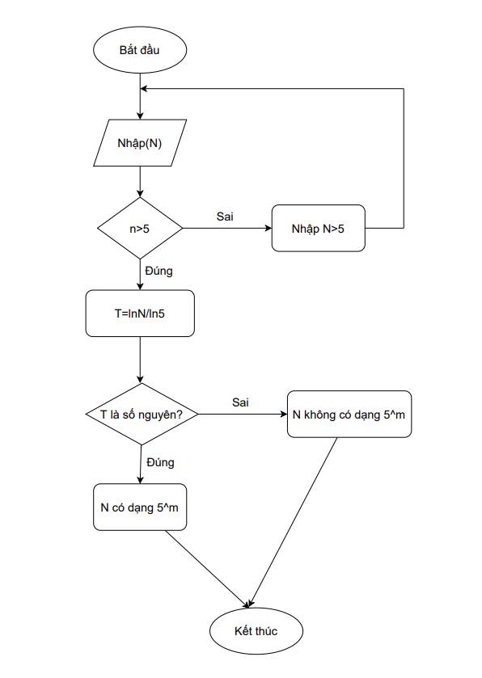

# **Những bài tập đầu tiên**
# **Câu 1: Vẽ lưu đồ thuật toán tính x^11 với số lượng phép nhân tối thiểu?**
### **Ý TƯỞNG:** 

- Ban đầu nhìn vào, mình sẽ nghĩ nhân 11 lần số x, nhưng nếu vậy thì đâu gọi là số lượng phép nhân tối thiểu được
- Như vậy có thể đặt ra giả thiết là nhân lũy thừa dần lên
- Để biết nhân như thế nào, ta lấy số mũ chia lấy dư cho 2:
  - 11 : 2 = 5 (dư 1)
  - 5 : 2 = 2 (dư 1)
  - 2 : 2 = 1 (dư 0)
- Vậy, để có thể lấy x^11 từ x, đầu tiên ta phải có x^2; rồi nhân 2 lần x^2 và x ta sẽ ra được x^5; Cuối cùng ta nhân 2 lần x^5 với x là sẽ ra được x^11
- Như vậy số phép nhân tối thiểu sẽ bằng: (số lần mũ chia 2) + (tổng số dư) = 3+2=5
### **LƯU ĐỒ THUẬT TOÁN:**

## **CODE**
```c++
#include <iostream>
using namespace std;
long long x,t; // Sử dụng "long long" vì lũy thừa sẽ ra số khá lớn 

int main(int argc, char** argv) {
	cout<<"Nhap vao x: ";
	cin>>x;
	t=x*x;
	t=t*t*x;
	t=t*t*x;
	cout<<"Tong la: "<<t;
	return 0;
}
```
### **TEST CASE**
> Input 1: 2                                
> Output 1: 2048

> Input 2: 5                                
> Output 2: 48828125
---------------


# **Câu 2: Hãy tính tổng các chữ số của số nguyên dương n**
### **Ý TƯỞNG:** 
- Bài này khá là đơn giản, ta sẽ áp dụng cách nhân phân tích:
  > Ví dụ: 256 = 2.(10^2) + 5.(10^1) + 6.(10^0) 
- Để tách ra từng số như vậy, chúng ta sẽ chia lấy dư lần lượt với 10:
  ```
   Ví dụ: 
   256 : 10 = 25 (dư 6)
   25 : 10 = 2 (dư 5)
   2 : 10 = 0 (dư 2)
   Khi này, ta thấy phần dư chính là những phần tử của số n ban đầu
   ==> Ta chỉ cần cộng chúng lại thì bài toán sẽ được giải quyết
   ```
### **LƯU ĐỒ THUẬT TOÁN:** 

### **CODE:** 
``` c++
#include <iostream>
using namespace std;
int n,i,s=0;

int main(int argc, char** argv) {
	cout<<"Nhap n: \n";
	cin>>n;
	i=n;
	while(i!=0){
		s=(i%10)+s;
		i=i/10;
	} cout<<s;
	return 0;
}
```
### **TEST CASE**
> Input 1: 256                               
> Output 1: 13

> Input 2: 123                           
> Output 2: 6
------

### **Ý TƯỞNG:** 
Nhìn vào đề bài, ta nhận định: 
- Trên tử sẽ là cấp số nhân cho đến khi số mũ bằng `n`; mỗi lần cộng phần số mới tử của phân số mới sẽ bằng tử của phân số cũ nhân với x
- Dưới mẫu sẽ cộng từ 1 đến số mũ và cứ như vậy đến khi mũ `n` thì dưới mẫu sẽ là tổng của 1 đến `n`. Tức là mỗi lần cộng phần số mới mẫu của phân số mới sẽ bằng mẫu của phân số cũ cộng với `n`
- Từ đó ta có thể áp dụng dòng lặp for để nhân tử và cộng mẫu, sau đó chia chúng ra đồng thời cộng với `S` trước đó. Cứ như vậy cho đến khi `i=n` thì ra sẽ dừng vòng lặp lại và xuất kết quả ra màn hình

### **LƯU ĐỒ THUẬT TOÁN:** 

### **CODE:** 
```c++
#include <iostream>
using namespace std;
int n,x,i=1,t=1,m=0;
double s=0;

int main(int argc, char** argv) {
	cout<<"Nhap x: \n"; cin>>x;
	cout<<"Nhap n: \n"; cin>>n;
	while (i<=n){
		t=t*x;
		m=m+i;
		s=(double)s+((double)t/(double)m);
		i++;
	} cout<<(double)s;
	return 0;
}
```
### **TEST CASE**
> Input 1: x=4; n=3                   
> Output 1: 20

> Input 2: x=2; n=6                          
> Output 2: 11.4476


--------------------------

### **Ý TƯỞNG**
- Nhìn bài toán ta thấy có ngay công thức nên việc còn lại đơn giản là chạy một vòng lặp với điều kiện dừng là khi `i>n`
- Giá trị ban đầu cần đặt là:
    - `S=0` vì ban đầu chưa có phép toán nào xảy ra
    - `i=` để cho vòng lặp chạy từ 1 đến khi `i>n` thì thôi
    - `t=1` dùng để tính bình phương 
  
- Nhìn sơ vào đề bài, ta thấy dấu của phép tính `âm` và `dương` thay đổi luân phiên liên tục, vậy nên ta sẽ cho nhân với `-1` vào mỗi lần lặp.
- Sau khi có giá trị lũy thừa, ta cộng với giá trị `S` cũ, Sau mỗi lần lặp ta tăng `i` lên 1 đơn vị.
- Cứ như vậy, khi không còn thỏa mãn điều kiện lặp nữa, ta sẽ được giá trị tổng `S` cuối cùng. Lúc này chỉ cần xuất giá trị ra màn hình nữa là bài toán đã hoàn thành.
### **LƯU ĐỒ THUẬT TOÁN**

### **CODE**
```c++
#include <iostream>
using namespace std;
int  x,n,s=0,i=1,t=1;

int main(int argc, char** argv) {
    cout<<"Nhap vao x: ";
    cin>>x;  
    cout<<"\nNhap vao n: ";
    cin>>n;

    while (i<=n){
        t=t*x*x*(-1);
        s=s+t;
        i++;
    }
    cout<<"S = "<<s;
    return 0;
}
```
### **TEST CASE**
> Input 1: x=4; n=3                   
> Output 1: S = -3856

> Input 2: x=2; n=6                          
> Output 2: S = 3276 

> Input 3: x=10; n=12                        
> Output 3: S = -1875725972 

-------------------------

### **Ý TƯỞNG**
- Nhìn vào đề bài, ta có thể thấy rằng đây là một bài toán cộng dồn căn bậc hai của x, và mỗi căn thì mũ `n` của `x` sẽ tăng thêm một đơn vị cho đến khi đến `n`
- Chắc chắn ta sẽ sử dụng vòng lặp với điều kiện dừng là khi `i>n` 
- Biến `temp` đảm nhận nhiệm vụ nhân dồn lũy thừa của `x`, sau đó cộng vào biến `S` và giá trị `temp` cũ, với căn bậc hai bên ngoài ==> Vì vậy ta phải sử dụng thư viện `<math.h>` để tính căn bậc hai `S=sqrt(S+temp)`
- Cuối cùng ta tăng `i` thêm 1 đơn vị khi hoàn thành các bước trên
- Và cứ lặp cho đến khi `i>n` ta sẽ xuất ra được kết quả cuối cùng
### **LƯU ĐỒ THUẬT TOÁN**

### **CODE**
```c++
#include <iostream>
#include <math.h> 
using namespace std;
int x,n,i=1,temp=1;
double s=0; 

int main(int argc, char** argv) {
	cout<<"Nhap x: "; cin>>x;
	cout<<"\nNhap N: "; cin>>n;
	while (i<=n){
		temp=temp*x;
		s=sqrt(temp+s);
		i++;
	}
	cout<<"\nS = "<<s;
	return 0;
} 
```
### **TEST CASE**
> Input 1: x=3; n=5                            
> Output 1: 15.884

> Input 2: x=5; y=2                           
> Output 2: 5.21882

> Input 3: x=10; y=4                            
> Output 3: 100.159
-------------------------

### **Ý TƯỞNG**
  >Ta thấy được rằng: tử lúc nào cũng bằng 1 và tử sẽ tăng dần từ 1 đến n. Vậy nên ta sẽ sử dụng dòng lặp for để cho `i` chạy từ 1 đến n. Sau đó cộng lại. Vậy là bài toán đã được giải quyết

### **LƯU ĐỒ THUẬT TOÁN**

### **CODE**
```c++
#include <iostream>
using namespace std;
int n,i=1;
double s=0;

int main(int argc, char** argv) {
	cout<<"Nhap n: "; cin>>n;

	while (i<=n){
		s=s+((double)1/i); // phải sử dụng (double) nhằm ép kiểu dữ liệu sang số thực 
		i++;
	}
	cout<<s;
	return 0;
}
```
### **TEST CASE**
> Input 1: 3                            
> Output 1: 1.83333

> Input 2: 6                           
> Output 2: 2.45

-------------------------------------

### **Ý TƯỞNG**
- Ban đầu ta sẽ cho nhập vào `n` với điều kiện rằng `n>=2`, nếu sai điều kiện thì ta sẽ cho người dùng nhập lại
- Bước đầu ta sẽ cho `i=2` ứng với `a2` rồi cho chạy đến khi số hạng `an` mà người dùng nhập.
- Tổng `S` ban đầu sẽ bằng -2, cũng chính là số hạng `a1` đề bài cho (Vì ta sẽ cộng dồn cho đến `an` nên tổng ban đầu chắc chắn phải bằng số hạng thứ nhất)
- `b=3` và `c=7` chính là số lũy thừa n trong công thức, ta sẽ nhân dần `b` với 3 và `c` với 7 ==> Việc tính lũy thừa `3^n` và `7^n` đã được giải quyết
- Và cứ vậy,vậy, vòng lặp cứ chạy cho đến khi sai điều kiện và xuất ra tổng `S`

### **LƯU ĐỒ THUẬT TOÁN**

### **CODE**
```c++
#include <iostream>
using namespace std;
int i=2, s=-2, b=3, c=7, n;

int main(int argc, char** argv) {
	cout<<"Nhap n: ";
	cin>>n;
	while (n<2){
		cout<<"\nNhap n>=2: ";
		cin>>n;
	}
	
	while (i<=n){
		b=3*b;
		c=7*c;
		s=5*s+2*b-6*c+12;
		i++;
	}
	
	cout<<"S = "<<s;
	
	return 0;
}
```
### **TEST CASE**
> Input 1: 2              
> Output 1: -274

> Input 2: 3                   
> Output 2: -3362

> Input 3: 4       
> Output 3: -31042

> Input 4: 5            
> Output 4: -255554

> Input 5: 6          
> Output 5: -1982194


-------------------------------------
# **Câu 8: Cho ba số thực *x,y,z* không âm là ba cạnh của một tam giác. Hãy cho biết tam giác đó là tam giác gì?**
### **Ý TƯỞNG**
Đầu tiên ta sẽ kiểm tra 3 cạnh đã nhập có phải là 3 cạnh của một tam giác không bằng công thức: tổng hai cạnh bất kì lớn hơn cạnh còn lại. Tức là `x+y>z`, `x+z>y` và `y+z>x`. Nếu đúng thì ta sẽ tiến hành kiểm tra loại tam giác, ngược lại ta sẽ xuất thông báo `Không phải ba cạnh của tam giác` và kết thúc chương trình

Để phân loại tam giác: 
- Tam giác vuông: áp dụng định lý Pitago, cạnh huyền bằng tổng bình phương 2 cạnh góc vuông

- Tam giác đều: 3 cạnh bằng nhau. Ta chỉ cần kiểm tra điều kiện `x==y` và `y==c`

- Tam giác cân:  có 2 cạnh bằng nhau nhưng không bằng cạnh còn lại. Ta sẽ kiểm tra thông qua điều kiện sau: `x==y || y==z || x==z`
- Tam giác vuông cân: là tam giác vừa vuông vừa cân :v 

- Tam giác tù là tam giác có một góc lớn hơn 90 độ. Điều kiện để là tam giác tù là bình phương 1 cạnh lớn hơn tổng bình phương 2 cạnh còn lại. Ta kiểm tra điều đó qua câu lệnh `(x*x > y*y+z*z )|| (y*y > x*x+z*z)|| (z*z > x*x+y*y)`

- Tam giác nhọn: là tam giác còn lại, để ở trường hợp cuối cùng

**Lưu ý:** Ta sẽ phải kiểm tra ba lần ở các loại tam giác (trừ tam giác đều và tam giác thương)
### **LƯU ĐỒ THUẬT TOÁN**

### **CODE**
```c++
#include <iostream>
#include <math.h> 
using namespace std;
double x,y,z;

int main(int argc, char** argv) {
cout<<"Nhap canh thu 1: ";
cin>>x;
cout<<"\nNhap canh thu 2: ";
cin>>y;
cout<<"\nNhap canh thu 3: "; 
cin>>z;

if ((x<y+z) && (y<x+z) && (z<x+y)){
	 
if(x*x==y*y+z*z || y*y==x*x+z*z || z*z==x*x+y*y ){

if ((x==y) || (y==z) || (x==z)){
cout<<"Tam giac vuong can!";}
		
else {cout<<"Tam giac vuong!";
}
}
else if ((x == y) && (y == z) ){
cout<<"Tam giac deu!";}
		
else if((x==y) || (y==z) || (x==z)){
cout<<"Tam giac can!";}

else if((x*x > y*y+z*z )|| (y*y > x*x+z*z)|| (z*z > x*x+y*y)){  
cout<<"Day la tam giac tu!";}
	 
else {cout<<"Tam giac nhon!";}}

else {cout<<"Khong phai 3 canh cua tam giac!";}

return 0;
}
```
### **TEST CASE**
> Input 1: 10, 15.6, 20.55               
> Output 1: Tam giac tu!

> Input 2: 2, 6, 5.7                         
> Output 2: Tam giac nhon!

> Input 3: 5.7, 8, 5.7               
> Output 3: Tam giac can!

> Input 4: 3, 4, 5                     
> Output 4: Tam giac vuong!

> Input 5: 12.75, 12.75, 12.75            
> Output 5: Tam giac deu!

> Input 6: 10, 2, 5.5                     
> Output 6: Khong phai 3 cạnh cua tam giac!
---------------------------------

# **Câu 9:** Vẽ lưu đồ kiểm tra xem số nguyên dương n có phải là số chính phương hay không?
### **Ý TƯỞNG**
  Đầu tiên, ta cần hiểu **số chính phương** là gì? 
  > Số chính phương là số bằng bình phương đúng của một số nguyên. Hay hiểu đơn giản, số chính phương là một số tự nhiên có căn bậc hai cũng là một số tự nhiên.

Ví dụ:
  > 1^2 =1    
    2^2 =4    
    3^2 =9    
    10^2=100 
    
Qua đó ta nhận định có thể sử dụng vòng lặp từ 0 đến chính nó. Nhưng vì ở đây chúng ta sử dụng lũy thừa nên việc chạy như vậy sẽ dẫn đến số khá lớn. Vì vậy chúng ta chỉ cần cho vòng lặp chạy từ 0 đến i^2 là được. Với mỗi lần chạy của i, nếu i^2=n thì gán thẳng i vào biến cờ (dem), còn nếu không phải thì tăng i lên tiếp tục. Việc còn lại sau khi thoát vòng lặp chỉ là kiểm tra xem biến cờ (dem) có lớn hơn 0 hay không. Nếu dem>0 thì xuất ra `n la so chinh phuong`, còn ngược lại (dem=0) thì xuất ra `n khong la so chinh phuong` 
   
### **LƯU ĐỒ THUẬT TOÁN**

### **CODE**
```c++
#include <iostream>
using namespace std;
int n,i=0,dem=0; 

int main(int argc, char** argv) {
    cout<< "Nhap n: ";
    cin>> n;
    while(i*i <= n){
        if(i*i == n){
            dem=i;
        }
        ++i;
    }
    if (dem!=0){
    	cout<<n<<" la so chinh phuong";
	} else {
		cout<<n<<" khong la so chinh phuong";
	}
	return 0;
}
```
### **TEST CASE**
> Input: 5                                   
> Output: 5 khong la so chinh phuong

> Input: 256                                 
> Output: 256 la so chinh phuong


# **Câu10:** Kiểm tra số nguyên dương n có dạng 5^m (m>=0) hay không?
### **Ý TƯỞNG**
- Nếu số có dạng 5^m chắc chắn không thể là số 0 hoặc số âm. Chính vì vậy nên khi nhập vào `N` ta phải kiếm tra xem `n>=0` thì ta mới tiếp tục thực hiện chương trình, không thì ta sẽ cho người dùng nhập lại.
- Một số có dạng 5^m thì khi chia cho 5 sẽ không có dư. Chính vì vậy ta sẽ cho chạy vòng lặp while với điều kiện là khi `n>=` và `n%5==0`. Khi điều kiện này thỏa mãn thì chứng tỏ `n` chia hết cho 5, vậy nên ta sẽ chia trực tiếp 5 vào n.
- Cứ lặp như vậy đến khi `n` không thỏa mãn điều kiện, khi này ta kiểm tra lần cuối:
    - Nếu số `n` này chia hết cho 5 thì lúc này chỉ có thể `n=5`, và ta chia lần nữa, nếu số dư = 0 thì ta kết luận "Đây là số có dạng 5^m"
    - Nếu số `n` không chia hết cho 5 thì nó sẽ loanh quanh khoảng 1 đến 9, vậy nên khi chia lấy dư cho 5 thì sẽ có dư ==> Lúc này, kết luận rằng "Đây không phải là số có dạng 5^m"
### **LƯU ĐỒ THUẬT TOÁN**

### **CODE**
```c++
#include <iostream>
using namespace std;
int n,i;

int main(int argc, char** argv) {
	cout<<"Nhap n: ";
	cin>>n;
	
	while (n<=0){
		cout<<"\nMoi nhap n>=5: ";
		cin>>n;
	}
	i=n;
	while ((n>5) && (n%5==0)){
		n=n/5;
	}
	if (n%5==0){
		cout<<i<<" co dang 5^m";
	}
	else cout<<i<<" khong co dang 5^m";
	return 0;
}
```
### **TEST CASE**
> Input 1: 5                           
> Output 1: 5 co dang 5^m

> Input 2: 13                           
> Output 2: 13 khong co dang 5^m

> Input 3: 125                           
> Output 3: 125 co dang 5^m
--------------------------------

# Câu 10: Sử dụng logarit để kiểm tra số nguyên dương n có dạng 5^m (m>=0) hay không? (Cách 2)
### **Ý TƯỞNG**
#### Theo công thức của Logarit thì: A=B^m có thể viết theo dạng log(A)/log(B)=m

- Ta biết rằng số `m`là một số nguyên nên ta chỉ cần chia `log(A)/log(B)` nếu được số nguyên thì ta khẳng định được ngay "Số đó có dạng 5^m", còn ngược nếu chia ra số lẻ thì ta sẽ xuất ra màn hình "Số này không cso dạng 5^m"
- Ta sẽ phải sử dụng thư viện `<math.h>` để tính `log`
### **LƯU ĐỒ THUẬT TOÁN**

### **CODE**
```c++
#include <iostream>
#include <math.h> 
using namespace std;
int n;
double t; 

int main(int argc, char** argv) {
	cout<<"Nhap n: "; cin>>n;
	while (n<5){
		cout<<"\nMoi ban nhap N>=5\n";
	    cin>>n;
	} 
	t=log(n)/log(5); 
	 if (t == (int)t){
	 	cout<<n<<" co dang 5^m";
	 } else {
	 	cout<<n<<" khong co dang 5^m";
	 } 

	return 0;
}
```
### **TEST CASE**
> Input 1: 5                           
> Output 1: 5 co dang 5^m

> Input 2: 8                           
> Output 2: 8 khong co dang 5^m

> Input 3: 15625                           
> Output 3: 15625 co dang 5^m
-----------

#GOODBYEEEE!
